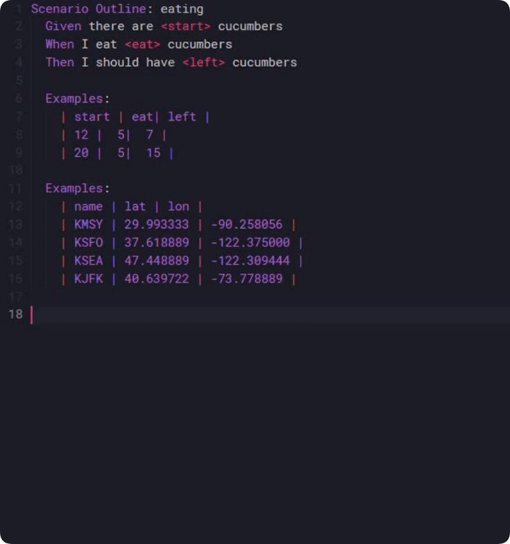

# Gherkin Table Formatter

## How to use

1. Select table with `|` as separator
2. Either use `Ctrl+Shift+P` and choose `Format Gherkin Table` or right click in editor and choose `Format Gherkin Table`

## Extension Settings

* `gherkin-table-formatter.alignment`: left/right Alignment used when formatting a table

-----------------------------------------------------------------------------------------------------------

**Enjoy!**
